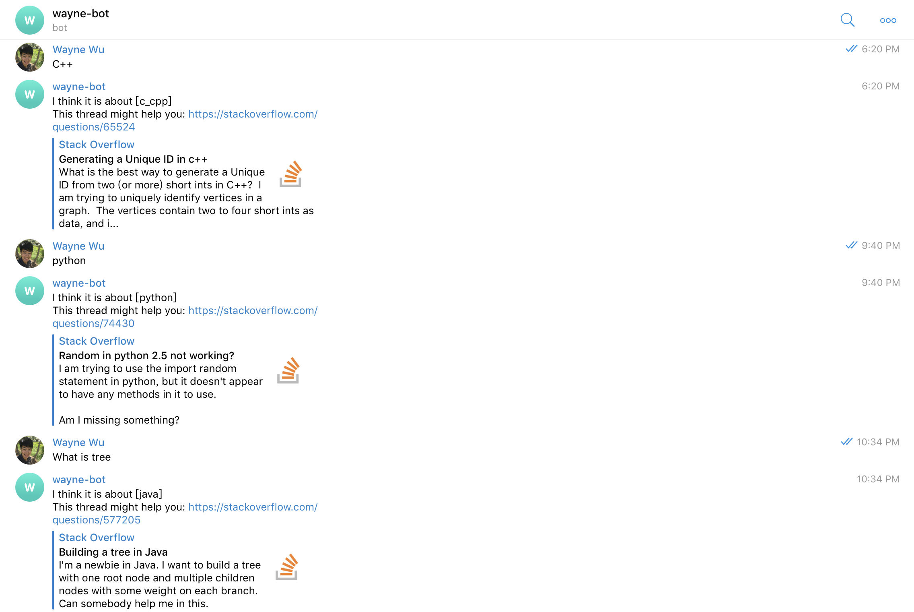

<div id="part_1"></div>

# 1. AI robots on telegram
This is the nlp project modified by the final project of coursera course: advanced machine learning specialization-Natural Language Processing.  
It can be also referred to the following respositories: <br>
```
1) Coursera-advanced-machine-learning-specialization/ 4.Natural-Language-Processing/ project
2) My-Sample-Projects/ 3.NLP/ project
```
It will be put on the telegram messenger supported by amazon web service (AWS) EC2 server and named wayne-bot (waynewu86Bot). <br>

Basically it will do the simple conversations. <br> 
it will also serve as a stackoverflow assistant where you can ask it about code questions and it will return stackoverflow related links.

- Result:

