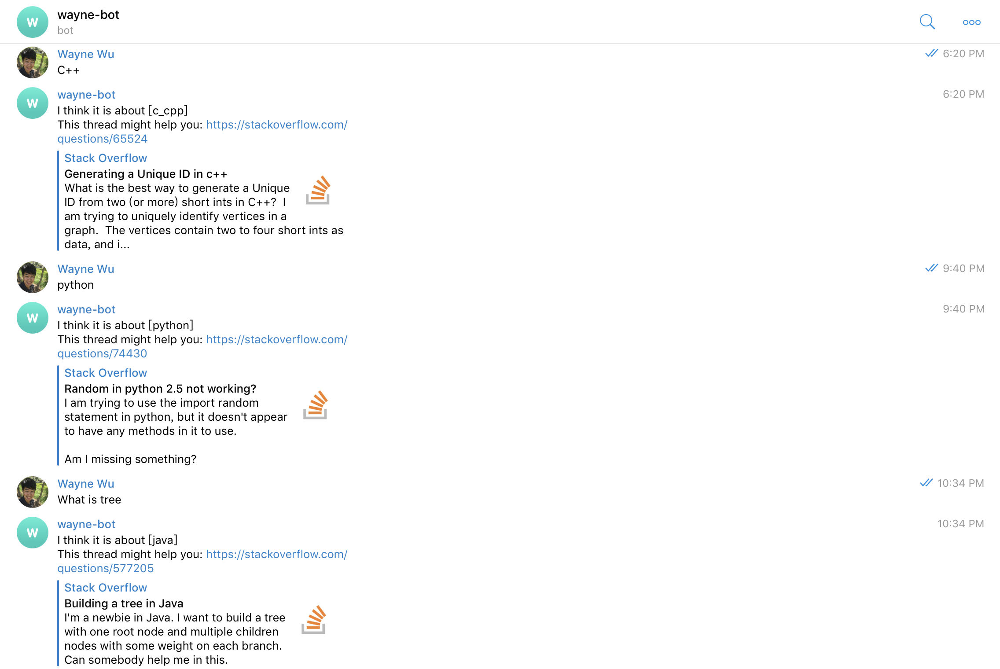

<div id="part_1"></div>

# 1. StackBot on Telegram
This is the nlp project modified and motivated by the final project of coursera course: advanced machine learning specialization-Natural Language Processing.  
It can be also referred to the following respositories: <br>
```
1) Coursera-advanced-machine-learning-specialization/ 4.Natural-Language-Processing/ project
2) My-Sample-Projects/ 3.NLP/ project
```
It will be put on the telegram messenger supported by amazon web service (AWS) EC2 server and named wayne-bot (waynewu86Bot). <br>

Basically it will do the simple conversations. <br> 
It will also serve as a stackoverflow assistant where you can ask it about code questions and it will return stackoverflow related links.

# To use by yourself:
1. **First create an account on amazon web service (ec2)**
- [Sign up for AWS](http://docs.aws.amazon.com/AWSEC2/latest/UserGuide/get-set-up-for-amazon-ec2.html#sign-up-for-aws). You will need to specify your credit card details, but for ease you can use Free Tier instances only, so you should not be charged.
- [Create a key pair for authentication](http://docs.aws.amazon.com/AWSEC2/latest/UserGuide/get-set-up-for-amazon-ec2.html#create-a-key-pair). If you use Windows, you will also need to install [PuTTY](https://www.chiark.greenend.org.uk/~sgtatham/putty/) to use SSH.
- [Create security group](http://docs.aws.amazon.com/AWSEC2/latest/UserGuide/get-set-up-for-amazon-ec2.html#create-a-base-security-group). You must add rules to a security group to allow you to connect to your future instance from your IP address using SSH. You might want to allow SSH access from all IPv4 addresses (set to 0.0.0.0/0), because your IP might change.

<br>

2. **Register a robot on [telegram](https://core.telegram.org/bots#6-botfather)**

- You will get a token id for the following connection step to the server.

<br>

3. **Create an instance (virtual machine) and connect to it via SSH**
- [Launch a free tier instance](http://docs.aws.amazon.com/AWSEC2/latest/UserGuide/EC2_GetStarted.html#ec2-launch-instance). For Amazon Machine Image (AMI) choose **Ubuntu Server 16.04 LTS**.
- [Connect to your instance](http://docs.aws.amazon.com/AWSEC2/latest/UserGuide/EC2_GetStarted.html#ec2-connect-to-instance-linux) using SSH. Use your own ip address and key pair.
>
    ssh -i xxxx-key-pair-useast2.pem ubuntu@ec2-xx-xxx-xxx-xx.us-east-2.compute.amazonaws.com

- Later on you can [start and stop](http://docs.aws.amazon.com/AWSEC2/latest/UserGuide/Stop_Start.html) your instance when needed, and [terminate](http://docs.aws.amazon.com/AWSEC2/latest/UserGuide/EC2_GetStarted.html#ec2-clean-up-your-instance) it in the end.

<br>

4. **Get your data ready**
- First clone this folder using [downgit](https://minhaskamal.github.io/DownGit/#/home).
- Run the following command in terminal to get required data:
>
    bash download.sh

<br>

5. **Put all data into your instance.**
- Use SCP to upload your data.
>
    scp -i xxxxx-key-pair-useast2.pem <your_data> ubuntu@ec2-xx-xxx-xxx-xx.us-east-2.compute.amazonaws.com:upload

- Use [tmux](https://medium.com/@peterxjang/a-minimalist-guide-to-tmux-13675fb160fa)
 to create a session to continuously run the server.
- In the instance, run the following command:
>
    python3 main_bot.py --token <Your telegram token>

<br>

# Result:

