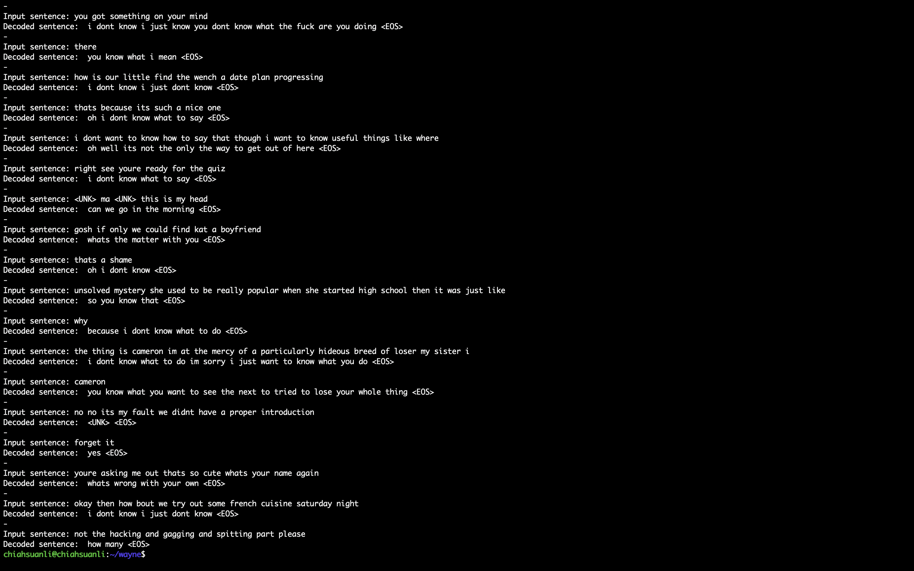

# 3. Movie Bot with keras
This is the nlp project completely done by Ting-Wei Wu with data preprocessing and keras seq2seq model establishment.  
The dataset is downloaded from [Cornell Movie Dialogs Corpus](https://www.cs.cornell.edu/~cristian/Cornell_Movie-Dialogs_Corpus.html).

First,  
Run `python train.py` to train the model on dataset preferably with gpu.  
Then,  
Run `python test.py` could interact with the bot with simple conversations which could be trained better with more computational sources.  
enjoy!!

Training data are extracted from movie_lines.tsv. Detailed descriptions are shown in the jupyter notebook: LHW4-Short-base.ipynb.

# Sample Results

