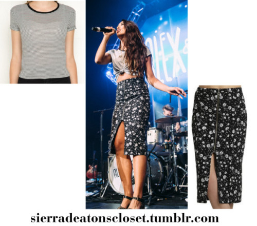
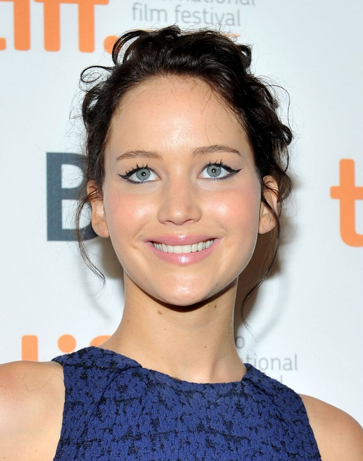
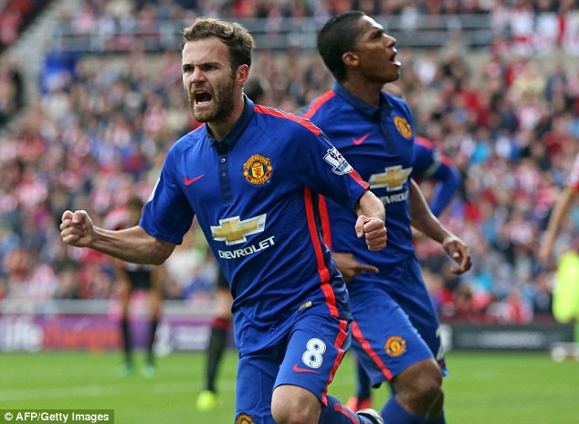

<div id="part_4"></div>

# 4. Image captioning
This is the CV-NLP related project associated with generating captions for any input image.

There are two different implementation for the applications: <br>

## 1. Realization in pytorch

This is the deep learning project completely done by Ting-Wei Wu. Basically, it will produce a natural-language description of an input image with the aid of pretrained model.

Here, we implemented 2-layer LSTM RNN network by concatenating image vectors with caption vectors to reproduce the outputs with pytorch framework. The image features were extracted by pretrained VGG16 CNN network.
(Thanks to pytorch book: [chenyuntc github](https://github.com/chenyuntc/pytorch-book/tree/master/chapter10-%E5%9B%BE%E5%83%8F%E6%8F%8F%E8%BF%B0(Image%20Caption)))

### 1) Dataset

The dataset are collected from `Google's Conceptual Captions Competition` dataset, consisting of ~3.3M images annotated with captions. To see more details, please refer to https://ai.google.com/research/ConceptualCaptions

The data folder is organized as follows:
```
data/
└── imgs/ (skipped)
   ├── 0.jpg
   ├── 1.jpg
   ├── 2.jpg
   ...
└── raw_data/ (skipped)
   ├── Train_GCC-training.tsv
   ├── Validation_GCC-1.1.0-Validation.tsv
├──caption.pth (skipped)
├──image_feature.pth (skipped)
├──pre_data.ipynb
```
We can use `pre_data.ipynb` to import raw data in tsv format in **raw_data/** and download images from the internet. Here for simplicity, we roughly train 50000 images in **imgs/** to give a quick glance at performances. <br>

Then some important features are stored in `caption.pth` in a dictionary format:
```
results = {
        'captions': captions,
        'captions_list': captions_list,
        'word2ix': word2ix,
        'ix2word': ix2word,
        'id2ix': id2ix,
        'ix2id': ix2id,
}
```

### 2) Training
Here we will prepare two preprocessed data: image and caption features. <br>
run 
```
python image_data.py
```
will generate `image_feature.pth` to store every image embedded vector with shape (,4096).

Then, run
```
python main.py train --batch_size=256
                     --embedding_dim=256
                     --hidden_dim=256
                     --num_layers=2
                     --lr=1e-3
                     --max_epoch=10
                     --save_model=1
```
to start training

### 3) Results
To see the results, please run
```
python -W ignore main.py generate --test-imgs=".jpg"
                                  --model_path="model_new.pth"
```

Here are some output examples. We use beam search algorithms to choose 3 most relevant generated captions for the images.

 <br>
```
a logo sign outside of the headquarters
a logo sign outside of a facility occupied by business
a logo sign outside of a facility occupied by business
```

 <br>
```
a model walks the runway at the fashion show during paris menswear fashion week
a model walks the runway at the fashion show during event
a model walks the runway at the fashion show during event
```

 <br>
```
interior design of a house
interior design for a new home
interior design of a new home
```

 <br>
```
actor arrives at the premiere
actor attends the world premiere
actor arrives at the premiere
```

 <br>
```
football player and battle for the ball
football player celebrates scoring his team 's second goal during the match
football player celebrates scoring his team 's fourth goal during the match
```

## 2. Final Project realizaiton in tensorflow
Please refers to `image_captioning.ipynb` to see the mechanisms and results. It is the final project of coursera course: advanced machine learning specialization-Introduction to Deep Learning.   
It can be also referred to the following respositories: <br>
```
1) Coursera-advanced-machine-learning-specialization/ 1.Introduction-to-Deep-Learning/ 10. with_pic_week6_final_project_image_captioning_clean.ipynb
```

It will caption the given image and return a descriptive sentence that depicts the graph.  

Sample result:


