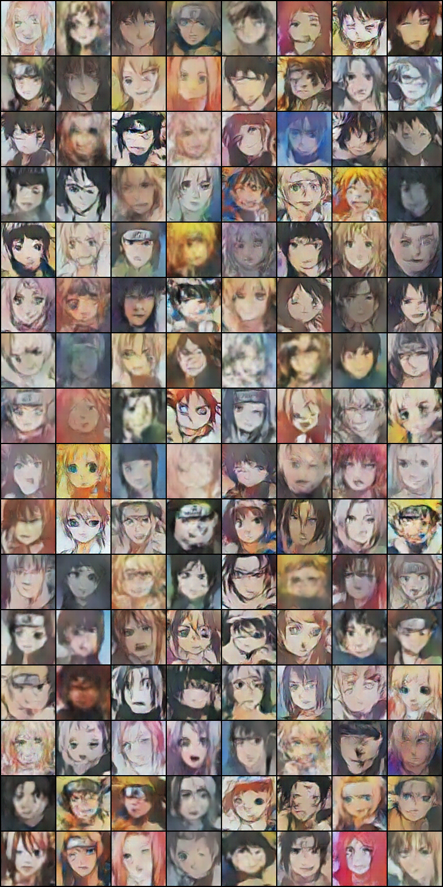
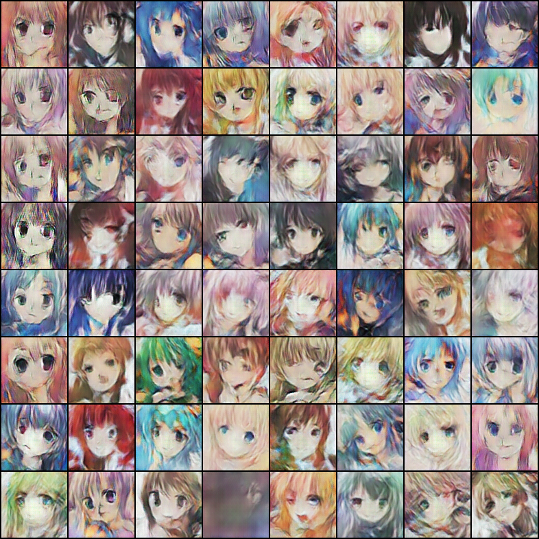

# 6. Deep Convolutional Generative Adversarial Networks for Naruto character generation
This is the deep learning project completely done by Ting-Wei Wu. Basically, it simulated the style drawing from Naruto, One-piece and hatsune figures to construct new characters by artificial intelligence. <br>

Here, we implemented convolutional neural network based generator & discriminator structures with pytorch framework to adversarially compete against each other to generate new stype figures that match with existing characters. <br>
(Thanks to pytorch book: [chenyuntc github](https://github.com/chenyuntc/pytorch-book/tree/master/chapter7-GAN%E7%94%9F%E6%88%90%E5%8A%A8%E6%BC%AB%E5%A4%B4%E5%83%8F))

## Dataset: There are two datasets in this work: Naruto+One-piece and hatsune
### Naruto (about 4k images)
The corresponding folder will be:
* *checkpoints/: to store models*.
* data/: scrape images from internet and face detection.
* *data-for-imagefolder/: store images for training*.
* *gen_imgs/: store generated images*. <br>
(Italics mean too large to upload then skip.)

- To start, I download the images from internet: [Zerochan: Naruto](https://www.zerochan.net/NARUTO) and [IMDB](https://www.imdb.com/title/tt6342474/mediaindex?page={}&ref_=ttmi_mi_sm) <br>
  It could be extracted by using the following command inside data/ folder:
  ```
  python scraping.py
  ```
  And the images are stored as follows:
 ```
 data/
└── imgs/
    ├── Akatsuki.%28NARUTO%29.240.92787.jpg
    ├── Akatsuki.%28NARUTO%29.240.202153.jpg
    ├── Akatsuki.%28NARUTO%29.240.241011.jpg
    ...
 ```

- Face detection:
 Then we do the face detection to extract the faces inside the images that we have downloaded by using opencv package:
 ```
 python detect_face.py
 ```

### Hatsune (about 30k images)
The corresponding folder will be:
1. checkpoints-hatsune/: to store models.
2. *data-for-imagefolder/: store images for training*.
3. gen_imgs-hatsune/: store generated images.
(Italics mean too large to upload then skip.)

Here I use the dataset from [National Taiawn University ADL x MLDS Course](https://www.csie.ntu.edu.tw/~yvchen/f106-adl/A4) which scrapes images from [Konachan.net](http://konachan.net/post/show/239400/aikatsu-clouds-flowers-hikami_sumire-hiten_goane_r)


## Train and Generate

- To use:
 1. To allow visdom for visualization, please run `python -m visdom.server` on the terminal first.
 2. Train:
 
 Naruto:
 ```
 python main.py train --gpu \
                      --vis=False \
                      --data_path="data-for-imagefolder/" \
                      --save_path="gen_imgs/" \
                      --netd_path=None \
                      --netg_path=None \
                      
 ```
 
 Hatsune:
 ```
 python main.py train --gpu \
                      --vis=False \
                      --data_path="data-for-imagefolder-hatsune/" \
                      --save_path="gen_imgs-hatsune/" \
                      --netd_path=None \
                      --netg_path=None \
                      
 ```
 
 3. Generate images:
 Naruto:
 ```
 python main.py generate --vis=False \
            --netd-path = checkpoints/netd_350.pth \
            --netg-path = checkpoints/netg_350.pth \
            --gen-img = result.png \
            --gen-num = 64
 ```

 Hatsune:
 ```
 python main.py generate --vis=False \
            --netd-path = checkpoints-hatsune/netd_99.pth \
            --netg-path = checkpoints-hatsune/netg_99.pth \
            --gen-img = result-hatsune.png \
            --gen-num = 64
 ```
 
 
 - Result: <br>
Naruto:


Hatsune:

 

