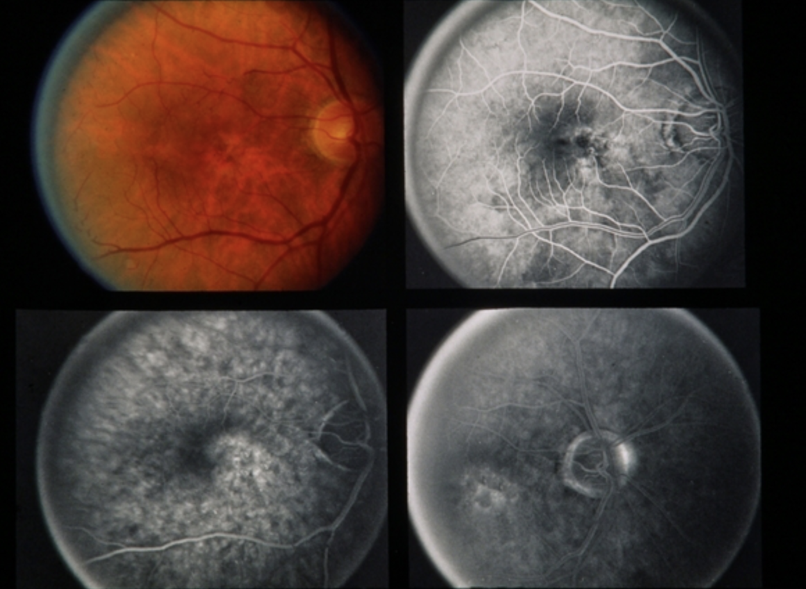
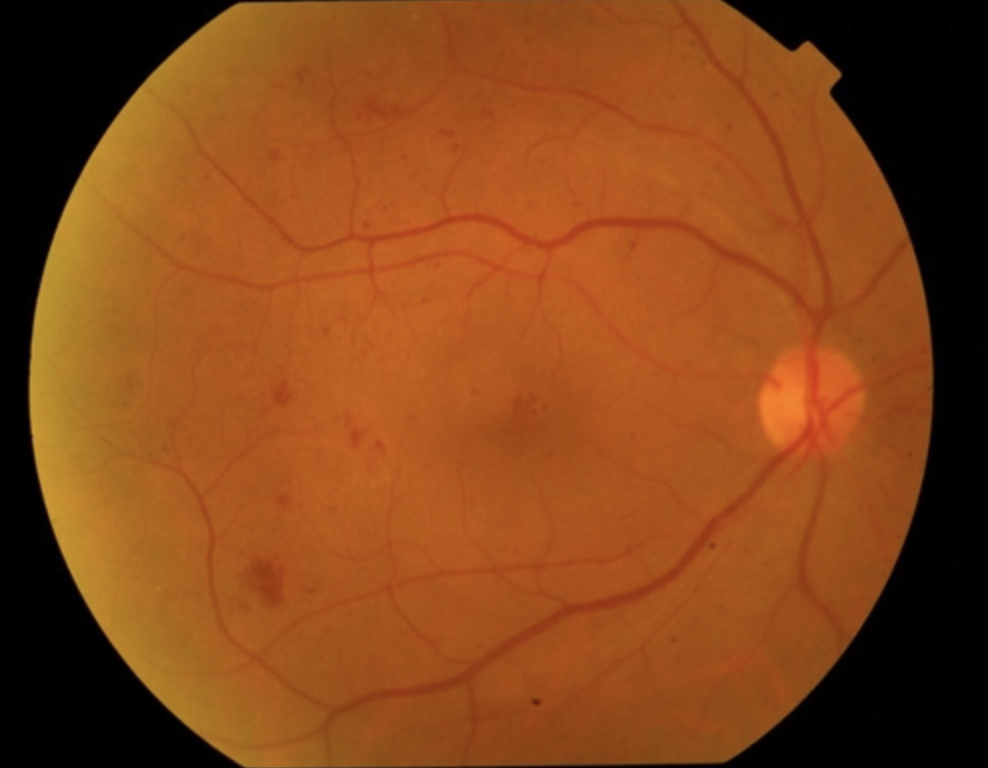

<div id="part_9"></div>

# 9. DeepEyeNet

This is a collaborative deep learning project called DeepEyeNet, originally licensed by [DeepEyeNet repo](https://github.com/huckiyang/DeepEyeNet) and referenced by [Image Captioning repo](https://github.com/yashk2810/Image-Captioning). The task is to generate medical descriptions of a typical retinal image input by using deep learning high level framework: keras.

* **Folder Structure**

```
data/ (download from following link)
└── data_path/ (all images path)
└── img_features/ (all extracted features)

eyenet_0819/ (download from following link)
└── data_path/ (all images path)
└── img_features/ (all extracted features)

model/
├── __init__.py
├── model.py
├── model_k.py

results/
├── results.txt
├── results_vgg16.pkl
├── results_vgg19.pkl
├── results_i3.pkl
├── results_resnet50.pkl
├── results_keywords_train.pkl
├── results_keywords_test.pkl

Image_captioning_step_by_step.ipynb
Image_captioning_evaluation.ipynb
Image_captioning_keyword_model.ipynb
train.py
utils.py
```

* **Dataset**

The dataset is from http://imagebank.asrs.org/ <br>
(Please only access the Images via Retina Image Bank Website. A full credit index has been set in each folder of a specific disease. Please check https://imagebank.asrs.org/terms-of-use#contributors and https://imagebank.asrs.org/terms-of-use#visitors)

* **Notebooks**

There are three jupyter notebooks to illustrate the whole projects:

1. [Image_captioning_step_by_step.ipynb](https://github.com/waynewu6250/ML_DL_Projects/blob/master/9.DeepEyeNet/Image_captioning_step_by_step.ipynb):
Step-by-step process to process the data and build the model & giving some example outputs.

2. [Image_captioning_evaluation.ipynb](https://github.com/waynewu6250/ML_DL_Projects/blob/master/9.DeepEyeNet/Image_captioning_evaluation.ipynb):
Evaluate the results by common image captioning metrics.

3. [Image_captioning_keyword_model.ipynb](https://github.com/waynewu6250/ML_DL_Projects/blob/master/9.DeepEyeNet/Image_captioning_keyword_model.ipynb):
Variation of different keyword embedded model to test the performances.

You can download all required files (preprocessed data, model checkpoints, evaluate results) in the following link: <br>
https://drive.google.com/open?id=1D9JJ8y7iNdmqYnfdkjAROtJFSApg3l9A


* **At a glance**

Here we use Keras with Tensorflow backend for the code. 
1. Classic VGG16, VGG19, InceptionV3, Resnet50 model are used for extracting the image features. 
2. We also preprocess the medical descriptions of each training data.The first, we feed it into LSTM model to get word features. 
3. Construct a custom Bi-LSTM model to feed each word and image feature at each time step and predict next word.
4. Here I create a keyword-model to feed each specified keywords in training data for each image. The uncertain number of keywords are averaged to be a word vector and fed simultaneously with image vector into the final model.
5. At prediction stage, I am using Greedy search and Beam search with k=3 for predicting the captions of the images.


# Train
You can use `train.py` to train the model directly by typing the following command in terminal (without using jupyter notebook) <br>
>
    python train.py -n <model name> -f <feature type>

Here model name you can type in `normal`, `encoder`, `mean`, or `transformer` to use different models <br>
For feature name you can type in `vgg16`, `vgg19`, `inceptionV3`, or `resnet50` to use different pretrained image features.


# Results
## Base Model Evaluation
I train the final model with and without the keyword reinforced to see the difference. For simplicity, I chose four main types of diseases around ~2000 images for training 3 epochs. Pretrained GLOVE word embeddings are used.

For model with VGG16 pre-extracted image features: <br>
The loss value of **1.8489** has been achieved without the keywords reinforced which gives barely satisfactory results.
The loss value of **0.5446** has been achieved with the keywords reinforced and the model converges much faster than the previous model.

For evaluation: we use bleu, CIDEr, Rouge scores to evaluate our results.
The average bleu scores are calculated as follows, as with all the training ~2000 images.

* Training State:

1) Normal Model

|    Model     | Phase | CIDEr  | BLEU-1 | BLEU-2 | BLEU-3 | BLEU-4 | ROUGE  |
| ------------ | ----- | ------ | ------ | ------ | ------ | ------ | ------ |
| VGG16        | Train | 6.3607 | 0.8449 | 0.7535 | 0.6352 | 0.5938 | 0.8633 |
| VGG19        | Train | 6.2702 | 0.8410 | 0.7523 | 0.6320 | 0.5882 | 0.8598 |
| InceptionV3  | Train | **8.6489** | **0.9825** | **0.9226** | **0.8182** | **0.7889** | **0.9850** |
| ResNet50     | Train | 7.5587 | 0.9222 | 0.8469 | 0.7326 | 0.6943 | 0.9325 |

2) Keyword Model

|    Model     | Phase | CIDEr  | BLEU-1 | BLEU-2 | BLEU-3 | BLEU-4 | ROUGE  |
| ------------ | ----- | ------ | ------ | ------ | ------ | ------ | ------ |
| VGG16        | Train | 9.0316 | 0.9602 | 0.8950 | 0.7879 | 0.7570 | 0.9672 | 
| VGG19        | Train | ------ | ------ | ------ | ------ | ------ | ------ |
| InceptionV3  | Train | 8.8784 | 0.9913 | 0.9342 | 0.8345 | 0.8074 | 0.9927 |
| ResNet50     | Train | ------ | ------ | ------ | ------ | ------ | ------ |

* Testing State:

1) Normal Model

|    Model     | Phase | CIDEr  | BLEU-1 | BLEU-2 | BLEU-3 | BLEU-4 | ROUGE  |
| ------------ | ----- | ------ | ------ | ------ | ------ | ------ | ------ |
| VGG16        | Test  | 3.5747 | 0.6255 | 0.5162 | 0.3828 | 0.3493 | 0.6532 | 
| VGG19        | Test  | 3.5622 | 0.6230 | 0.5213 | 0.3807 | 0.3418 | 0.6547 |
| InceptionV3  | Test  | **4.5284** | 0.6709 | **0.5910** | **0.4594** | **0.4342** | 0.6944 |
| ResNet50     | Test  | 4.1382 | **0.6888** | 0.5776 | 0.4307 | 0.3943 | **0.7037** |

2) Keyword Model

|    Model     | Phase | CIDEr  | BLEU-1 | BLEU-2 | BLEU-3 | BLEU-4 | ROUGE  |
| ------------ | ----- | ------ | ------ | ------ | ------ | ------ | ------ |
| VGG16        | Test  | 4.6886 | 0.6853 | 0.5964 | 0.4654 | 0.4388 | 0.7127 | 
| VGG19        | Test  | ------ | ------ | ------ | ------ | ------ | ------ |
| InceptionV3  | Test  | 4.8400 | 0.6924 | 0.6096 | 0.4790 | 0.4539 | 0.7138 |
| ResNet50     | Test  | ------ | ------ | ------ | ------ | ------ | ------ |


The calculation could be repeatedly checked in the jupyter notebook `Image_captioning_evaluation.ipynb`.
And the score results are also stored in `results/results.txt`

## Different Keyword Model Evaluation
Here we extend our applications to **different keyword embedding** into our model to enhance the quality of captioning with keywords added. <br>
In addition to the first method where we call mean model by averaging all keyword vectors, we add three other methods: Attention-based, Encoder-based and Transformer-based by mingling image and keyword vectors. Then we put the hybrid vector into our main Bi-LSTM model. (Here we use)

Here are some results (You can find more in the jupyter notebook `Image_captioning_keyword_model.ipynb` and predicted results in `results_keywords_train.pkl` and `results_keywords_test.pkl`)

* Training State:

|    Model    | Phase  | CIDEr  | BLEU-1 | BLEU-2 | BLEU-3 | BLEU-4 | ROUGE  | Accuracy |
| ----------- | ------ | ------ | ------ | ------ | ------ | ------ | ------ | -------- |
| Base Model  | Train  | 6.3607 | 0.8449 | 0.7535 | 0.6352 | 0.5938 | 0.8633 | -------- |
| ----------- | ------ | ------ | ------ | ------ | ------ | ------ | ------ | -------- |
| Attention   | Train  | **9.0169** | 0.9984 | **0.9440** | **0.8448** | **0.8196** | 0.9987 | 0.9641 |
| Encoder     | Train  | 9.0090 | 0.9983 | 0.9432 | 0.8440 | 0.8189 | 0.9987 | 0.9636 |
| Mean        | Train  | 8.7111 | 0.9827 | 0.9227 | 0.8194 | 0.7906 | 0.9855 | 0.8837 |
| Transformer | Train  | 9.0160 | **0.9987** | 0.9435 | 0.8443 | 0.8191 | **0.9990** | **0.9682** |

* Testing State:

|    Model    | Phase  | CIDEr  | BLEU-1 | BLEU-2 | BLEU-3 | BLEU-4 | ROUGE  | Val Accuracy |
| ----------- | ------ | ------ | ------ | ------ | ------ | ------ | ------ | ------------ |
| Base Model  | Test   | 3.5747 | 0.6255 | 0.5162 | 0.3828 | 0.3493 | 0.6532 | ------------ |
| ----------- | ------ | ------ | ------ | ------ | ------ | ------ | ------ | ------------ |
| Attention   | Test   | **4.9554** | 0.7146 | 0.6247 | **0.4859** | **0.4604** | 0.7361 | 0.8146 |
| Encoder     | Test   | 4.9505 | 0.7153 | **0.6294** | 0.4837 | 0.4583 | 0.7335 | 0.8159 |
| Mean        | Test   | 4.9049 | **0.7196** | 0.6216 | 0.4823 | 0.4518 | **0.7466** | 0.7783 |
| Transformer | Test   | 4.8792 | 0.7084 | 0.6139 | 0.4726 | 0.4453 | 0.7348 | **0.8168** |


## Example readouts

You can check out some examples below. The rest of the examples are in the jupyter notebook `Image_captioning_step_by_step.ipynb`. You can run the Jupyter Notebook and try out some retinal image examples for the medical description.

**1. Training Image:**<br>
<br>
```
* Model without keywords:
Predicted Caption: 71 year old white female. srnv md. re 20/50 le 20/20.
Ground Truth Caption: 67-year-old white male. srnv-md. re 20/40 le 20/15.
* Model with keywords:
Predicted Caption: 67 year old white male. srnv md. re 20/40 le 20/15.
Ground Truth Caption: 67-year-old white male. srnv-md. re 20/40 le 20/15.
```

**2. Testing Image:**<br>
<br>
```
* Model without keywords:
Predicted Caption: diabetic retinopathy fundus image.
Ground Truth Caption: diabetic retinopathy fundus image.
* Model with keywords:
Predicted Caption: diabetic retinopathy fundus image.
Ground Truth Caption: diabetic retinopathy fundus image.
```

# Dependencies:
* Keras 1.2.2
* Tensorflow 0.12.1
* tqdm
* numpy
* pandas
* matplotlib
* pickle
* PIL
* glob


