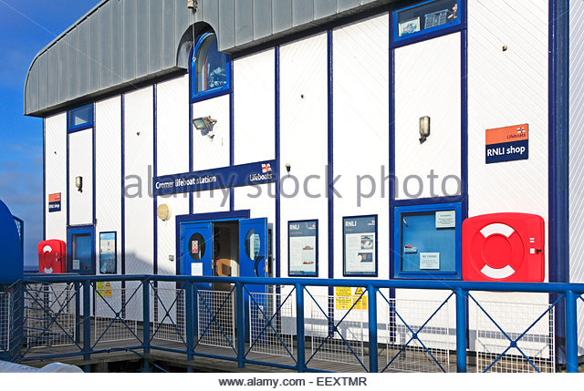
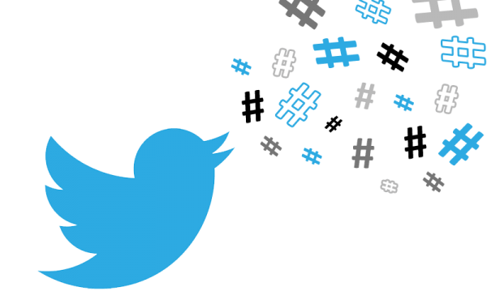

# Machine learning and Deep learning related projects

## Ting-Wei Wu
My side project gallery for collections and refinement.   
  

[1. StackBot on telegram](#1)  
[2. Movie Bot with pytorch](#2)  
[3. Movie Bot with keras](#3)  
[4. Image captioning](#4)  
[5. Recurrent Neural Network for Taiwanese song's lyrics generation](#5)  
[6. Deep Convolutional Generative Adversarial Networks for Naruto character generation](#6)  
[7. Malaria Cell Prediction](#7)  
[8. Twitter hashtags](#8)  
9. Mario-in-RL (To be updated)

（You can use [downgit](https://minhaskamal.github.io/DownGit/#/home) to clone any individual project for your interest. And follow the instructions in each README.md to use.）

---

### [1. StackBot on telegram](https://github.com/waynewu6250/ML_DL_Projects/tree/master/1.StackBot-on-telegram/#part_1)
This is a nlp project modified by the final project of coursera course: advanced machine learning specialization-Natural Language Processing.  
It will be put on the telegram messenger supported by amazon web service (AWS) EC2 server and named wayne-bot (waynewu86Bot).  

Basically it will do the simple conversations.   
it will also serve as a stackoverflow assistant where you can ask it about code questions and it will return stackoverflow related links.

---

### [2. Movie Bot with pytorch](https://github.com/waynewu6250/ML_DL_Projects/tree/master/2.Movie-bot-pytorch#part_2)
This is a nlp project completely done by Ting-Wei Wu with data preprocessing and pytorch seq2seq model establishment.  
There are two kinds of robots for you to choose: **MovieBot** and **ChickBot**.  
Please find more in the [project folder](https://github.com/waynewu6250/ML_DL_Projects/tree/master/2.Movie-bot-pytorch#part_2).

Training data are extracted from Cornell Dialogs Movie Corpus and XiaoHuangJi. Detailed descriptions are shown in the README.md in the subfolder.

---

### [3. Movie Bot with keras](https://github.com/waynewu6250/ML_DL_Projects/tree/master/3.Movie-bot-keras/#part_3)
This is a nlp project completely done by Ting-Wei Wu with data preprocessing and keras seq2seq model establishment.  

Training data are extracted from movie_lines.tsv. Detailed descriptions are shown in the jupyter notebook: LHW4-Short-base.ipynb.

---

### [4. Image captioning](https://github.com/waynewu6250/ML_DL_Projects/tree/master/4.Image-captioning/#part_4)
This is the CV-NLP related project associated with generating captions for any input image.

There are two different implementation for the applications: pytorch self-realization and modified final project for coursera online course.

It will caption the given image and return a descriptive sentence that depicts the graph.

  
a logo sign outside of the headquarters

---

### [5. Recurrent Neural Network for Taiwanese song's lyrics generation](https://github.com/waynewu6250/ML_DL_Projects/tree/master/5.Lyrics-RNN#part_5)
This is a deep learning project completely done by Ting-Wei Wu. Basically, it will generate some intriguing lyrics based on the major taiwanese songs' style. The networks are based on simple RNN model with major three singers.  

---

### [6. Deep Convolutional Generative Adversarial Networks for Naruto character generation](https://github.com/waynewu6250/ML_DL_Projects/tree/master/6.Comics-GAN#part_6)
This is a deep learning project completely done by Ting-Wei Wu. Basically, it simulated the style drawing from Naruto figures to construct new naruto characters by artificial intelligence.  

---

### [7. Malaria Cell Prediction](https://github.com/waynewu6250/ML_DL_Projects/tree/master/7.Malaria-prediction#part_7)
This is a deep learning project with CNN Resnet models from pytorch. Image data are provided via Kaggle dataset: [Malaria Cell Images Dataset](https://www.kaggle.com/iarunava/cell-images-for-detecting-malaria/home). The task is to classify cell images into two categories: parasitized or uninfected.

---

### [8. Twitter hashtags](https://github.com/waynewu6250/ML_DL_Projects/blob/master/8.Twitter-hashtags#part_8)
This is a pyspark project that will analyze the most frequent hashtags used by individual users.   

