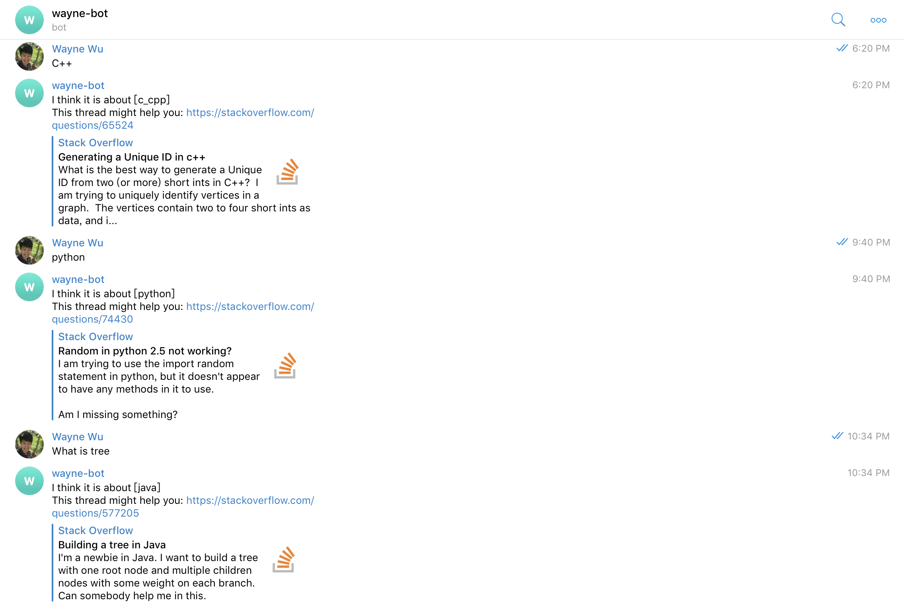

# Machine learning and Deep learning related projects
## Ting-Wei Wu
My side project gallery for collections and refinement  

[1. AI robots on telegram](#1)

[2. Image captioning](#2)

[3. Twitter hashtags](#3)

[4. Movie Bot with keras](#4)

[5. Movie Bot with pytorch](#5)

[6. Deep Convolutional Generative Adversarial Networks for Naruto character generation](#6)

[7. Recurrent Neural Network for Taiwanese song's lyrics generation](#7)

[8. Malaria Cell Prediction](#8)

---

### 1. AI robots on telegram
This is the nlp project modified by the final project of coursera course: advanced machine learning specialization-Natural Language Processing.  
It will be put on the telegram messenger supported by amazon web service (AWS) EC2 server and named wayne-bot (waynewu86Bot).  

Basically it will do the simple conversations.   
it will also serve as a stackoverflow assistant where you can ask it about code questions and it will return stackoverflow related links.

---

### 2. Image captioning
This is the CV-related project modified by the final project of coursera course: advanced machine learning specialization-Introduction to Deep Learning.   

It will caption the given image and return a descriptive sentence that depicts the graph.

---

### 3. Twitter hashtags
This is the pyspark project that will analyze the most frequent hashtags used by individual users.   

---

### 4. Movie Bot with keras
This is the nlp project completely done by Ting-Wei Wu with data preprocessing and keras seq2seq model establishment.  

Training data are extracted from movie_lines.tsv. Detailed descriptions are shown in the jupyter notebook: LHW4-Short-base.ipynb.

---

### 5. Movie Bot with pytorch
This is the nlp project completely done by Ting-Wei Wu with data preprocessing and pytorch seq2seq model establishment.  
It is same with the project Movie-bot-keras except new implementation with pytorch model.

Training data are extracted from movie_lines.tsv. Detailed descriptions are shown in the README.md in the subfolder.

---

### 6. Deep Convolutional Generative Adversarial Networks for Naruto character generation
This is the deep learning project completely done by Ting-Wei Wu. Basically, it simulated the style drawing from Naruto figures to construct new naruto characters by artificial intelligence.  

---

### 7. Recurrent Neural Network for Taiwanese song's lyrics generation
This is the deep learning project completely done by Ting-Wei Wu. Basically, it will generate some intriguing lyrics based on the major taiwanese songs' style. The networks are based on simple RNN model with major three singers.  

---

### 8. Malaria Cell Prediction
This is the deep learning project with CNN Resnet models from pytorch. Image data are provided via Kaggle dataset: [Malaria Cell Images Dataset](https://www.kaggle.com/iarunava/cell-images-for-detecting-malaria/home). The task is to classify cell images into two categories: parasitized or uninfected.

