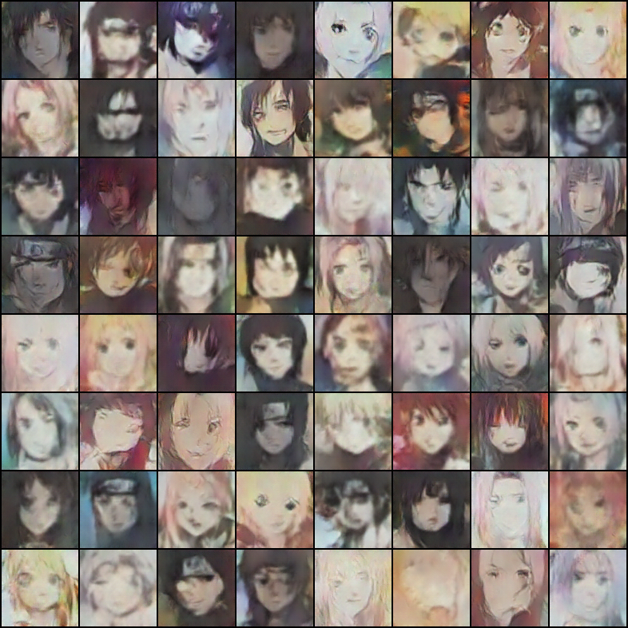

# Machine learning and Deep learning related projects
## Ting-Wei Wu
My side project gallery for collections and refinement  

[1. AI robots on telegram](#1)  
[2. Image captioning](#2)  
[3. Twitter hashtags](#3)  
[4. Movie Bot with keras](#4)  
[5. Movie Bot with pytorch](#5)  
[6. Deep Convolutional Generative Adversarial Networks for Naruto character generation](#6)  
[7. Recurrent Neural Network for Taiwanese song's lyrics generation](#7)  
[8. Malaria Cell Prediction](#8)  
[9. DeepEyeNet](#9)  

---

### [1. AI robots on telegram](https://github.com/waynewu6250/ML_DL_Projects/tree/master/1.AI-robots-on-telegram#part_1)
This is a nlp project modified by the final project of coursera course: advanced machine learning specialization-Natural Language Processing.  
It will be put on the telegram messenger supported by amazon web service (AWS) EC2 server and named wayne-bot (waynewu86Bot).  

Basically it will do the simple conversations.   
it will also serve as a stackoverflow assistant where you can ask it about code questions and it will return stackoverflow related links.

---

### [2. Image captioning](https://github.com/waynewu6250/ML_DL_Projects/tree/master/2.Image-captioning#part_2)
This is the CV-NLP related project associated with generating captions for any input image.

There are two different implementation for the applications: pytorch self-realization and modified final project for coursera online course.

It will caption the given image and return a descriptive sentence that depicts the graph.

a logo sign outside of the headquarters

---

### [3. Twitter hashtags](https://github.com/waynewu6250/ML_DL_Projects/blob/master/3.Twitter-hashtags#part_3)
This is a pyspark project that will analyze the most frequent hashtags used by individual users.   

---

### [4. Movie Bot with keras](https://github.com/waynewu6250/ML_DL_Projects/blob/master/4.Movie-bot#part_4)
This is a nlp project completely done by Ting-Wei Wu with data preprocessing and keras seq2seq model establishment.  

Training data are extracted from movie_lines.tsv. Detailed descriptions are shown in the jupyter notebook: LHW4-Short-base.ipynb.

### [5. Movie Bot with pytorch](https://github.com/waynewu6250/ML_DL_Projects/blob/master/5.Movie-bot-pytorch#part_5)
This is a nlp project completely done by Ting-Wei Wu with data preprocessing and pytorch seq2seq model establishment.  
It is same with the project Movie-bot-keras except new implementation with pytorch model.

Training data are extracted from movie_lines.tsv. Detailed descriptions are shown in the README.md in the subfolder.

---

### [6. Deep Convolutional Generative Adversarial Networks for Naruto character generation](https://github.com/waynewu6250/ML_DL_Projects/tree/master/6.Comics-GAN#part_6)
This is a deep learning project completely done by Ting-Wei Wu. Basically, it simulated the style drawing from Naruto figures to construct new naruto characters by artificial intelligence.  

---

### [7. Recurrent Neural Network for Taiwanese song's lyrics generation](https://github.com/waynewu6250/ML_DL_Projects/tree/master/7.Lyrics-RNN#part_7)
This is a deep learning project completely done by Ting-Wei Wu. Basically, it will generate some intriguing lyrics based on the major taiwanese songs' style. The networks are based on simple RNN model with major three singers.  

---

### [8. Malaria Cell Prediction](https://github.com/waynewu6250/ML_DL_Projects/tree/master/8.Malaria-prediction#part_8)
This is a deep learning project with CNN Resnet models from pytorch. Image data are provided via Kaggle dataset: [Malaria Cell Images Dataset](https://www.kaggle.com/iarunava/cell-images-for-detecting-malaria/home). The task is to classify cell images into two categories: parasitized or uninfected.

---

### [9.DeepEyeNet](https://github.com/waynewu6250/ML_DL_Projects/tree/master/9.DeepEyeNet#part_9)
This is a collaborative deep learning project called DeepEyeNet, originally licensed by [DeepEyeNet repo](https://github.com/huckiyang/DeepEyeNet) and referenced by [Image Captioning repo](https://github.com/yashk2810/Image-Captioning). The task is to generate medical descriptions of a typical retinal image input by using deep learning high level framework: keras. The dataset is from  
http://imagebank.asrs.org/

 
Medical descriptions: 
66-year-old white female. drusen.

